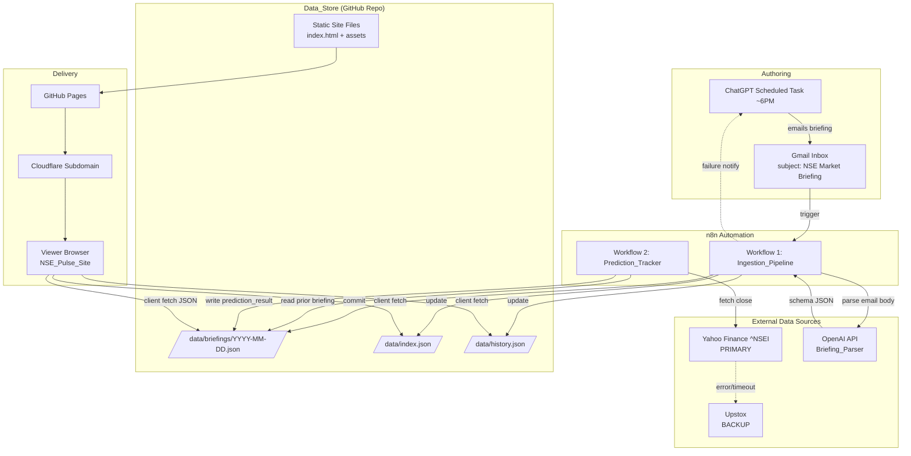
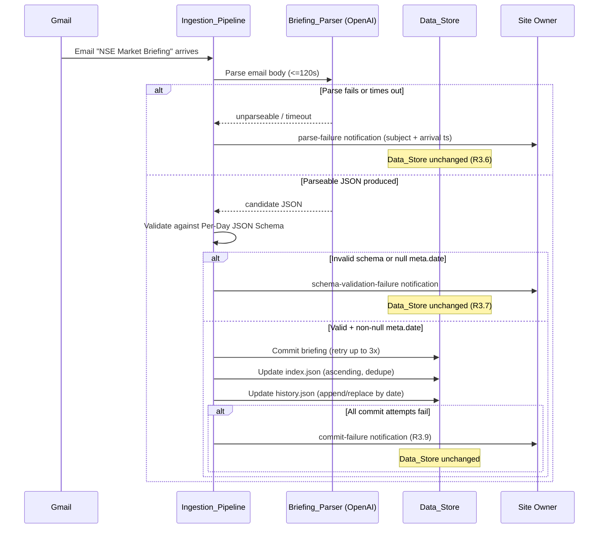
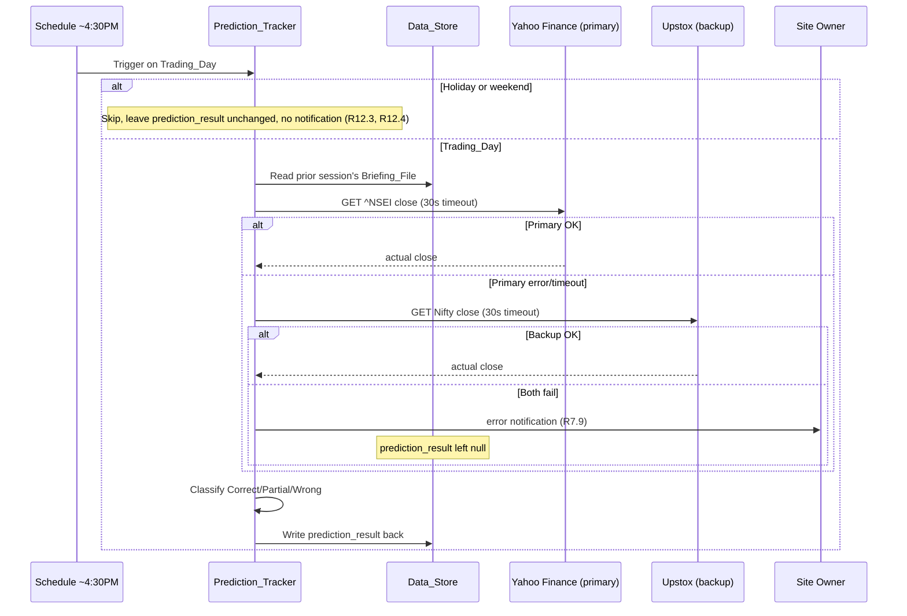
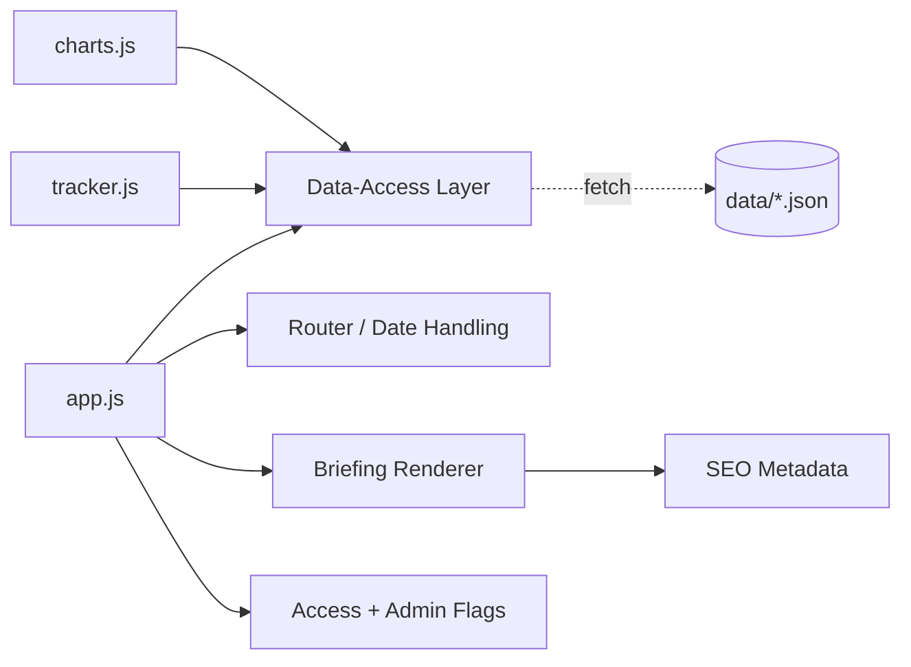

# Design Document: NSE Pulse

## Overview

NSE Pulse is a serverless, file-backed market-briefing product. A daily briefing authored by ChatGPT is delivered by email, transformed into a strict JSON contract by an n8n automation pipeline, version-controlled in a GitHub repository, and rendered by a framework-free static website hosted on GitHub Pages behind a Cloudflare subdomain. A second automation verifies the prior session's forecast against the actual Nifty 50 close and writes the outcome back into the same JSON contract.

The architecture has four cooperating subsystems (per the Glossary in the requirements):

- **Ingestion_Pipeline** (n8n Workflow 1) — watches Gmail, parses the briefing email into schema-conforming JSON, and commits the per-day file plus the index and history aggregates (Requirements 2, 3).
- **Prediction_Tracker** (n8n Workflow 2) — fetches the actual Nifty50 close, classifies the prior outlook, and writes `prediction_result` back (Requirement 7, 12).
- **Data_Store** — the GitHub repository holding all JSON data and the static site files (Requirements 1, 2, 10).
- **NSE_Pulse_Site** — the client-side static site that reads JSON at runtime and renders briefings, charts, and the accuracy tracker (Requirements 4, 5, 6, 8, 9, 13, 14).

### Design Principles

1. **The JSON data contract is the single source of truth.** Every reader and writer agrees on the Per-Day JSON Schema. Field names are frozen after the first production commit (Requirements 1.12, 11.7).
2. **No backend at runtime.** The site is pure HTML/CSS/JS with Chart.js; all data access happens via client-side `fetch` against raw GitHub-hosted JSON (Requirements 10.1, 10.2, 10.5).
3. **Null over omission.** Missing values are explicit `null`, never dropped keys, so renderers and the parser stay total (Requirements 1.11, 3.3, 13.1, 13.5).
4. **Future paywall without re-architecture.** A single configurable data-access layer and access/admin flags isolate the eventual auth/paywall transition (Requirement 11).

### Phased Roadmap

This design targets **MVP B**: briefing display, last 30 days of history, Nifty and FII/DII charts, and prediction accuracy tracking. The data contract and the access-model abstractions (single data-access module, access-control flag, admin-view flag) are built now so that **Phase 4** — Supabase authentication plus a Razorpay/Stripe paywall over the gated content defined in Requirement 11.2 — can be added later without changing schema field names or the site's data-access surface (Requirements 11.1, 11.7).

## Architecture

### System Component Diagram



### Ingestion Data Flow (Workflow 1)



### Prediction Verification Data Flow (Workflow 2)



### Technology Choices

| Concern | Choice | Rationale / Requirement |
|---|---|---|
| Static hosting | GitHub Pages | Free, zero server maintenance (R10.1) |
| Custom domain | Cloudflare subdomain with GitHub Pages fallback | R10.3, R10.4 |
| Front end | Vanilla HTML/CSS/JS, no framework | R10.5 |
| Charts | Chart.js (CDN) | Lightweight charting without a framework (R6) |
| Data transport | Client-side `fetch` of raw JSON | R10.2 |
| Automation | n8n (two workflows) | R3, R7 |
| Parsing | OpenAI API | R3.2 Briefing_Parser |
| Market data | Yahoo Finance `^NSEI` (primary), Upstox (backup) | R7.1, R7.8 |
| Version control / store | GitHub repository | R1, R2 |

## Components and Interfaces

### Data_Store Layout

The GitHub repository holds both the data layer and the static site:

```
/
├── data/
│   ├── briefings/
│   │   ├── 2024-05-31.json        # one Briefing_File per Trading_Day (R1.1)
│   │   └── ...
│   ├── index.json                 # Index_File (R2.1)
│   └── history.json               # History_File (R2.3)
├── index.html                     # single-page app shell (R4, R10)
└── assets/
    ├── css/
    │   └── style.css              # responsive layout (R9)
    └── js/
        ├── app.js                 # bootstrap, router, data-access layer, renderer
        ├── charts.js              # Chart.js historical charts (R6)
        └── tracker.js             # accuracy tracker view (R8)
```

The static site reads `data/` from the same origin (or the raw GitHub URL) via client-side `fetch`, so no build step couples the site to the data (R10.1, R10.2).

### Front-End Module Map



#### Data-Access Layer (Requirement 11.1)

A single configurable module is the only code that issues network requests for data. This is the seam for the future paywall.

```js
// Conceptual interface
const config = {
  dataBaseUrl: "https://<owner>.github.io/<repo>/data", // configurable base
  accessControlEnabled: false,  // R11.3 / R11.4
  adminViewEnabled: false       // R14.5 / R14.6
};

DataAccess.getIndex()                 // -> Promise<IndexFile>      (R5.1, R13.3)
DataAccess.getHistory()               // -> Promise<HistoryFile>    (R6.1, R6.8)
DataAccess.getBriefing(dateStr)       // -> Promise<BriefingFile>   (R4.1, R5.2, R13.2)
DataAccess.getLatestDate(index)       // -> string (max date)       (R4.1)
```

Every reader (renderer, charts, tracker) goes through `DataAccess`; nothing else performs `fetch`. When the paywall ships, gating logic (R11.2, R11.5) is enforced inside this one module.

#### Router / Date Handling (Requirements 4.1, 5)

- Reads the requested date from the URL (e.g., `?date=YYYY-MM-DD` or hash). No date → latest date from the Index_File (R4.1).
- Validates the requested date: it must be a syntactically valid ISO-8601 calendar date **and** present in the Index_File. Otherwise access is blocked with a "no briefing available" message (R5.3, R5.5, R5.6).
- A date present in the index but with a missing file yields a distinct "no briefing for that date" message while keeping the navigator usable (R5.4).

#### Briefing Renderer (Requirement 4)

Renders the displayed Briefing_File into labeled sections, each tolerant of `null`/missing/malformed values (R13):

| Section | Content | Requirement |
|---|---|---|
| Header | Logo + Date_Navigator, sticky | R4.2, R9.6 |
| Hero strip | Exactly 4 cards: Nifty50, Sensex, FII net, DII net | R4.3 |
| Market Snapshot | Breadth advances/declines, sector leaders/laggards, market tone | R4.4 |
| Movers | Key gainers table + key losers table | R4.5 |
| Macro | Brent crude, India 10y yield, domestic triggers, global triggers | R4.6 |
| Deep Dive | `deep_dive.full_text` in a collapsible container | R4.7 |
| Outlook | Per-scenario probability bars (length ∝ probability), support/resistance, key watch | R4.8 |

Collapsible controls toggle a section to the opposite of its current visibility (R4.9). Each section renders independently so one bad field cannot suppress the others (R13.5); a `null` scalar renders a distinct placeholder dash (R13.1); an empty list field shows a per-section "no entries" message (R13.4).

#### Charts Module — `charts.js` (Requirement 6)

- Reads the History_File via the data-access layer and builds four Chart.js charts in a tabbed container: **Nifty Trend**, **FII/DII Flows**, **Market Breadth**, **Sectors** (R6.2).
- Selecting a tab shows that chart and hides the others; Nifty Trend is shown first on initial render (R6.3, R6.7).
- Each chart uses the most recent 30 Trading_Days, or all available if fewer than 30 (R6.4, R6.5).
- `null` data points are omitted (point skipped, line spans the gap) without substituting a value (R6.6) — implemented with `spanGaps: true` and `null` y-values, never `0`.
- Retrieval/parse failure → "historical chart data unavailable" message (R6.8); zero Trading_Days → "no historical data yet" message in place of charts (R6.9).

#### Accuracy Tracker Module — `tracker.js` (Requirement 8)

- Renders a calendar of the most recent 30 Trading_Days; each day with a non-null `accuracy_tag` gets a distinct marker for Correct/Partial/Wrong (R8.1).
- Computes rolling accuracy over the most recent 30 Trading_Days that have a non-null `accuracy_tag`: `round(correct / tagged * 100, 1)` (R8.2).
- If tagged days exist but none are Correct → "no verified correct predictions yet" (R8.3); if no tagged days exist → "no verified predictions yet" (R8.5).
- Selecting a marked day displays that day's Briefing_File (R8.4).
- Holidays/weekends (no Briefing_File) are excluded from both markings and the percentage (R12.5, R12.2).

#### Responsive Layout Strategy (Requirement 9)

- Breakpoint at **768px**, implemented with CSS media queries (no JS layout).
- `>= 768px`: two-column layout; Deep Dive, Macro, Outlook expanded by default (R9.1, R9.4).
- `320px..767px`: single column; Deep Dive, Macro, Outlook collapsed by default; no horizontal scrolling (R9.2, R9.3, R9.5).
- Header is `position: sticky/fixed` so it stays visible while content scrolls beneath it (R9.6).

#### SEO Metadata (Requirement 14.1–14.3)

On render, set `document.title` and the `<meta name="description">` to include the briefing date and market tone. If either is `null`/unavailable, build the strings from only the available values rather than blocking the page; meta description is capped at 160 characters (R14.2, R14.3).

#### Access-Control & Admin-View Flags (Requirements 11, 14.4–14.7)

- `accessControlEnabled` (default off in MVP): off → all content open (R11.3); on → gated content (non-latest briefings, all charts, `deep_dive`) requires authentication, otherwise an auth prompt is shown; failed auth keeps content withheld with a failure message (R11.2, R11.4, R11.5, R11.6).
- `adminViewEnabled` (default off): off → `admin_notes` excluded from both rendered page and delivered source (R14.5); on with non-empty notes → display them (R14.6); on with null/empty → render without notes, no blocking (R14.7).

### n8n Workflow 1 — Ingestion_Pipeline (Requirements 2, 3)

Node-by-node:

1. **Gmail Trigger** — watches the inbox, filters on subject exactly "NSE Market Briefing"; fires within the 5-minute polling window (R3.1).
2. **Extract Email Body** — normalizes the email body (HTML→text) and captures `subject` and `arrival timestamp` for use in failure notifications.
3. **OpenAI Parse (Briefing_Parser)** — calls the OpenAI API with a defensive system prompt (below); request budget ≤120s (R3.2). Output: candidate JSON.
4. **Schema Validation** — validates the candidate against the Per-Day JSON Schema and checks `meta.date` is present and non-null (R3.4, R3.7).
5. **Branch — parse failure** — if node 3 returns unparseable output or exceeds 120s → **Parse-Failure Notify** (subject + arrival ts), stop, leave store unchanged (R3.6).
6. **Branch — schema failure** — if node 4 fails or `meta.date` is null/absent → **Schema-Validation-Failure Notify**, stop, leave store unchanged (R3.7).
7. **GitHub Commit — Briefing_File** — write/overwrite `/data/briefings/<meta.date>.json`; on commit error retry up to 3 additional times (R3.4, R3.5, R3.8).
8. **GitHub Update — Index_File** — read `index.json` (create if missing, R2.5); insert `meta.date` keeping ascending order; if date already present leave unchanged (no duplicate) (R2.1, R2.2, R2.6).
9. **GitHub Update — History_File** — read `history.json` (create if missing, R2.5); build the day's time-series row (Nifty close, change %, FII net cr, DII net cr, breadth advances/declines); append in ascending order, or replace the existing row if the date is already present (R2.3, R2.4, R2.7).
10. **Branch — commit failure** — if any commit exhausts its 3 retries → **Commit-Failure Notify** (briefing date), treat as failed, leave store unchanged (R3.8, R3.9).

The index/history updates are **idempotent by date**: re-committing the same date overwrites the briefing (R3.5), keeps a single index entry (R2.6), and replaces (not appends) the history row (R2.7).

#### Briefing_Parser Defensive System Prompt (Requirement 3.3)

The OpenAI node uses a system prompt that:
- Describes the exact Per-Day JSON Schema (objects, field names, types, enums).
- Instructs the model to **emit every field**, using `null` for any value absent from the email (R3.3, R1.11) — never omit keys.
- Enforces enums: `meta.session_status` ∈ {Trading, Holiday}; `prediction_result.accuracy_tag` ∈ {Correct, Partial, Wrong, null}.
- Enforces invariants: numeric fields as JSON numbers (R1.5); each scenario `probability` 0–100; `range_low ≤ range_high`; 1–5 scenarios.
- Requests strict JSON only (no prose), suitable for JSON-mode/`response_format: json_object`.

### n8n Workflow 2 — Prediction_Tracker (Requirements 7, 12)

Node-by-node:

1. **Schedule Trigger (~4:30PM IST)** — fires after the cash session close.
2. **Trading-Day Gate** — if today is a weekend or Market_Holiday, skip: leave `prediction_result` unchanged and send **no** notification (R12.3, R12.4). (Holiday list maintained in workflow config.)
3. **Fetch Prior Session Briefing** — read the Briefing_File whose Outlook is being verified (the prior trading session's file) from the Data_Store.
4. **Fetch Nifty50 — Primary (Yahoo Finance)** — GET `^NSEI` close with a 30-second request timeout (R7.1).
5. **Fetch Nifty50 — Backup (Upstox)** — only if primary errors or exceeds 30s; GET Nifty close with a 30-second timeout (R7.8).
6. **Branch — both fail** — if primary and backup both error/timeout → leave all `prediction_result` fields `null` and **Error Notify** the owner (R7.9). Stop.
7. **Classify** — compute `actual_change_pct`, evaluate each scenario's inclusive range, and assign the Accuracy_Tag with tie-break rules (algorithm below) (R7.2–R7.6).
8. **GitHub Write — prediction_result** — write `actual_close`, `actual_change_pct`, `matched_scenario`, `accuracy_tag`, and `verified_at` back into the Briefing_File (R7.7).

#### Accuracy Classification Algorithm (Requirements 7.2–7.6)

```
inputs: actual_close, scenarios[]  (each {name, probability, range_low, range_high})
in_range(s) := s.range_low <= actual_close <= s.range_high      # inclusive (R7.2)

matching := [s for s in scenarios if in_range(s)]
top := scenario with highest probability; ties broken by first in list order (R7.3)

if actual_close in range of top:
    accuracy_tag = "Correct";  matched_scenario = top.name        # R7.4
elif matching is non-empty:
    accuracy_tag = "Partial"
    matched_scenario = name of matching scenario with highest probability,
                       ties broken by first in list order          # R7.5
else:
    accuracy_tag = "Wrong";  matched_scenario = null               # R7.6
```

## Data Models

All data models use explicit `null` for missing values rather than omitting keys (R1.11). Field names below are frozen after the first production commit (R1.12, R11.7).

### Per-Day JSON Schema (Requirement 1)

```jsonc
{
  "meta": {
    "date": "YYYY-MM-DD",            // string, ISO-8601, equals filename date (R1.3); non-null for a committed file (R3.4)
    "session_status": "Trading",     // enum: "Trading" | "Holiday" (R1.3)
    "market_tone": "Cautiously bullish", // string <=60 chars, or null (R1.3)
    "sources": ["Reuters", "NSE"]     // v2, OPTIONAL string[], default [] (citation list)
  },
  "summary": {
    "nifty50":  { "close": 22500.0, "change_pct": 0.42 },     // numbers or null (R1.4, R1.5, R1.11)
    "sensex":   { "close": 74000.0, "change_pct": 0.38 },
    "broader_market": { "smallcap_pct": 0.9, "midcap_pct": 0.6 },
    "breadth":  { "nifty500_advances": 280, "nifty500_declines": 210 },
    "sectors":  {
      "leaders":  ["IT", "Auto"],     // list of strings
      "laggards": ["FMCG"],           // list of strings
      "count_advanced": 7             // number or null
    },
    "key_gainers": [ { "symbol": "INFY", "change_pct": 3.1 } ],  // list (may be empty -> R13.4)
    "key_losers":  [ { "symbol": "HDFC", "change_pct": -2.2 } ], // list (may be empty -> R13.4)
    "institutional_flows": { "fii_net_cr": -1200.5, "dii_net_cr": 980.0 }, // numbers or null
    "macro": {
      "brent_crude": 82.3, "india_10y_yield": 7.05,            // numbers or null
      "usd_inr": 83.42, "gold": 71500.0,                        // v2, OPTIONAL numbers or null
      "india_vix": 13.8, "us_10y_yield": 4.28                   // v2, OPTIONAL numbers or null
    },
    "global_indices": [                                         // v2, OPTIONAL, default []
      { "name": "Dow Jones", "change_pct": -0.32 }               // { name: string, change_pct: number|null }
    ]
  },
  "triggers": {
    "domestic": ["RBI policy hold"],  // list of strings (R1.6)
    "global":   ["US CPI print"]      // list of strings (R1.6)
  },
  "deep_dive": {
    "full_text": "….long-form analysis…",  // string or null (R1.7)
    "summary_takeaway": "FII selling offset by strong domestic flows." // v2, OPTIONAL string|null, <=280 chars
  },
  "outlook": {
    "base_case": "Range-bound with positive bias",  // string or null
    "scenarios": [                                   // 1..5 objects (R1.8)
      { "name": "Bullish breakout", "probability": 55, "range_low": 22500, "range_high": 22750 },
      { "name": "Range-bound",      "probability": 35, "range_low": 22300, "range_high": 22500 },
      { "name": "Breakdown",        "probability": 10, "range_low": 22100, "range_high": 22300 }
    ],
    "support_levels":    [22300, 22100],   // list of numbers (may be empty -> R13.4)
    "resistance_levels": [22750, 22900],   // list of numbers
    "key_watch":         ["US CPI", "Crude above $85"]  // list of strings (may be empty -> R13.4)
  },
  "prediction_result": {
    "actual_close": 22610.0,        // number or null (R1.10)
    "actual_change_pct": 0.49,      // number or null
    "matched_scenario": "Bullish breakout", // string or null
    "accuracy_tag": "Correct",      // enum: "Correct" | "Partial" | "Wrong" | null (R1.10)
    "verified_at": "2024-05-31T11:00:00Z"   // ISO-8601 date-time or null (R1.10)
  },
  "admin_notes": "private note"     // OPTIONAL string <=5000 chars (R14.4)
}
```

#### Field Types, Nullability, Enums, and Invariants

| Path | Type | Nullable | Enum / Constraint | Req |
|---|---|---|---|---|
| `meta.date` | string (ISO-8601) | no (for committed file) | equals filename date | 1.3, 3.4 |
| `meta.session_status` | string | no | `Trading` \| `Holiday` | 1.3 |
| `meta.market_tone` | string | yes | ≤60 chars | 1.3 |
| `summary.*` numeric | number | yes | JSON number when present | 1.4, 1.5, 1.11 |
| `summary.sectors.leaders/laggards` | string[] | — | list of strings | 1.4 |
| `summary.key_gainers/key_losers` | object[] | — | may be empty | 1.4, 13.4 |
| `triggers.domestic/global` | string[] | — | list of strings | 1.6 |
| `deep_dive.full_text` | string | yes | — | 1.7 |
| `outlook.scenarios` | object[] | — | length 1–5 | 1.8 |
| `outlook.scenarios[].name` | string | — | ≤60 chars | 1.8 |
| `outlook.scenarios[].probability` | number | — | 0 ≤ p ≤ 100 | 1.8 |
| `outlook.scenarios[].range_low/high` | number | — | `range_low ≤ range_high` | 1.8, 1.9 |
| `outlook.support/resistance_levels` | number[] | — | may be empty | 1.8, 13.4 |
| `outlook.key_watch` | string[] | — | may be empty | 1.8, 13.4 |
| `prediction_result.actual_close` | number | yes | — | 1.10 |
| `prediction_result.actual_change_pct` | number | yes | — | 1.10 |
| `prediction_result.matched_scenario` | string | yes | — | 1.10 |
| `prediction_result.accuracy_tag` | string | yes | `Correct` \| `Partial` \| `Wrong` \| null | 1.10 |
| `prediction_result.verified_at` | string | yes | ISO-8601 date-time | 1.10 |
| `admin_notes` | string | optional | ≤5000 chars | 14.4 |
| `meta.sources` | string[] | optional | default `[]` | v2 |
| `summary.macro.usd_inr/gold/india_vix/us_10y_yield` | number | optional, yes | number or null | v2 |
| `summary.global_indices` | object[] | optional | default `[]`, items `{name, change_pct}` | v2 |
| `deep_dive.summary_takeaway` | string | optional, yes | ≤280 chars | v2 |

Schema v2 fields (marked `v2` above) are additive and optional — a v1-only file (missing all of them) remains valid, and `normalizeBriefing` fills them with `null`/`[]`. No existing field name has been renamed or removed, per the "never change field names once live" rule.

**Schema invariants** (must hold for every valid Briefing_File):
- I1: `outlook.scenarios` has between 1 and 5 elements (R1.8).
- I2: every scenario has `0 ≤ probability ≤ 100` (R1.8).
- I3: every scenario has `range_low ≤ range_high` (R1.9).
- I4: `meta.session_status ∈ {Trading, Holiday}` (R1.3).
- I5: `prediction_result.accuracy_tag ∈ {Correct, Partial, Wrong, null}` (R1.10).
- I6: all schema keys are present (no omitted keys); absent values are `null` (R1.11).

### Index_File Schema (`/data/index.json`, Requirement 2)

```jsonc
{
  "dates": ["2024-05-29", "2024-05-30", "2024-05-31"]  // ascending calendar order, no duplicates (R2.1, R2.2, R2.6)
}
```

- Invariant: `dates` is strictly ascending and duplicate-free (R2.1, R2.6).
- Contains exactly the set of dates for which a Briefing_File exists (R2.1).
- The site presents these most-recent-first in the Date_Navigator (R5.1) by reversing the ascending list at render time.

### History_File Schema (`/data/history.json`, Requirement 2)

```jsonc
{
  "series": [
    {
      "date": "2024-05-31",          // ascending order, one row per Trading_Day (R2.3, R2.4)
      "nifty_close": 22610.0,        // number or null
      "nifty_change_pct": 0.49,      // number or null
      "fii_net_cr": -1200.5,         // number or null
      "dii_net_cr": 980.0,           // number or null
      "advances": 280,               // number or null
      "declines": 210                // number or null
    }
  ]
}
```

- Invariant: `series` is ordered ascending by `date` and duplicate-free; re-committing a date replaces its row (R2.4, R2.7).
- Any individual time-series value may be `null`; charts omit null points without substitution (R6.6).


## Correctness Properties

*A property is a characteristic or behavior that should hold true across all valid executions of a system — essentially, a formal statement about what the system should do. Properties serve as the bridge between human-readable specifications and machine-verifiable correctness guarantees.*

The following properties were derived from the acceptance-criteria prework analysis. Acceptance criteria classified as INTEGRATION (external fetch/timeout, n8n trigger latency, DNS/hosting), SMOKE (deployment/architecture/schema-freeze governance), or pure UI/visual EXAMPLE checks are intentionally excluded from property-based testing and are covered by the Testing Strategy instead. Redundant criteria were consolidated per the reflection step.

### Property 1: Schema conformance and null-preservation round-trip

*For any* valid Briefing_File, serializing it to JSON and parsing it back yields an object with an identical set of keys (no key omitted, every absent value present as explicit `null`), with all top-level objects (`meta`, `summary`, `triggers`, `deep_dive`, `outlook`, `prediction_result`) and their required sub-fields present, all present numeric `summary`/`macro` fields typed as JSON numbers, `triggers.domestic`/`triggers.global` as lists of strings, `deep_dive.full_text` a string or null, `meta.session_status ∈ {Trading, Holiday}`, and `prediction_result.accuracy_tag ∈ {Correct, Partial, Wrong, null}`.

**Validates: Requirements 1.2, 1.3, 1.4, 1.5, 1.6, 1.7, 1.10, 1.11, 3.3**

### Property 2: Outlook scenario invariants

*For any* valid Briefing_File, `outlook.scenarios` contains between 1 and 5 objects, and every scenario satisfies `0 ≤ probability ≤ 100`, `name` length ≤ 60, and `range_low ≤ range_high`.

**Validates: Requirements 1.8, 1.9**

### Property 3: Schema validation accepts valid and rejects invalid

*For any* candidate object, the schema validator returns valid if and only if the object conforms to the Per-Day JSON Schema and has a non-null `meta.date`; any violation (missing key, wrong type, out-of-range probability, `range_low > range_high`, bad enum, or null/absent `meta.date`) causes rejection and leaves the Data_Store unchanged.

**Validates: Requirements 3.4, 3.7, 1.12**

### Property 4: Briefing filename derives from meta.date

*For any* valid Briefing_File, the committed file path equals `/data/briefings/{meta.date}.json`.

**Validates: Requirements 1.1, 3.4**

### Property 5: Index file is complete, ascending, duplicate-free, and idempotent

*For any* sequence of committed briefing dates (including repeats), the resulting Index_File `dates` list is sorted in strictly ascending calendar order, contains no duplicates, and contains exactly the set of distinct committed dates; inserting an already-present date leaves the list unchanged.

**Validates: Requirements 2.1, 2.2, 2.6**

### Property 6: History file is ascending and replace-not-append idempotent

*For any* sequence of committed Trading_Days (including repeats with differing values), the History_File `series` is ordered ascending by `date` with one row per distinct date; re-committing an existing date replaces that date's row with the latest values rather than appending a duplicate.

**Validates: Requirements 2.3, 2.4, 2.7**

### Property 7: Latest-date default selection

*For any* non-empty Index_File, when no date is requested the site selects the briefing whose date equals the maximum (most recent) date in the index.

**Validates: Requirements 4.1**

### Property 8: Date-navigator descending order

*For any* Index_File, the Date_Navigator presents exactly the index dates ordered most-recent-first (the descending sort of the ascending index).

**Validates: Requirements 5.1**

### Property 9: Date-access gate

*For any* requested date string, access is granted if and only if the string is a valid ISO-8601 calendar date that is present in the Index_File; the navigator's selectable set equals the index set (which equals the set of dates with a Briefing_File), and any other requested date is blocked with a "no briefing available" message.

**Validates: Requirements 5.3, 5.5, 5.6, 12.2**

### Property 10: Hero strip renders exactly four cards

*For any* Briefing_File, the hero strip renders exactly four cards corresponding to Nifty50, Sensex, FII net flow, and DII net flow, each showing its value or a placeholder when the value is null.

**Validates: Requirements 4.3**

### Property 11: Outlook probability bars are proportional

*For any* `outlook.scenarios` list, each rendered probability bar's filled fraction equals that scenario's `probability` divided by 100.

**Validates: Requirements 4.8**

### Property 12: Collapsible toggle is an involution

*For any* collapsible section in any initial visibility state, a single toggle switches it to the opposite state, and two consecutive toggles restore the original state.

**Validates: Requirements 4.9**

### Property 13: Exactly one chart tab visible

*For any* selection among the four chart tabs (Nifty Trend, FII/DII Flows, Market Breadth, Sectors), exactly the selected tab's content is visible and all other tabs' content is hidden.

**Validates: Requirements 6.3, 6.7**

### Property 14: Chart window is the most recent min(30, n) days

*For any* History_File with `n` Trading_Days, every chart renders exactly `min(30, n)` data series points corresponding to the most recent `min(30, n)` dates in ascending order.

**Validates: Requirements 6.4, 6.5**

### Property 15: Null chart points are omitted without substitution

*For any* History_File series, the set of plotted points for a metric equals the series entries whose value for that metric is non-null, preserving order, with no substituted (zero/interpolated) value introduced for any omitted null point.

**Validates: Requirements 6.6**

### Property 16: Accuracy classification correctness

*For any* `outlook.scenarios` list and any actual Nifty50 close, the classification computes: a scenario is in-range iff `range_low ≤ close ≤ range_high` (inclusive); the highest-probability scenario is the first scenario attaining the maximum probability in list order; if the close is in the highest-probability scenario's range the tag is "Correct" with `matched_scenario` = that scenario's name; otherwise if the close is in any scenario's range the tag is "Partial" with `matched_scenario` = the highest-probability matching scenario (ties by list order); otherwise the tag is "Wrong" with `matched_scenario` = null.

**Validates: Requirements 7.2, 7.3, 7.4, 7.5, 7.6, 7.7**

### Property 17: Rolling accuracy computation and display state

*For any* sequence of Trading_Days with accuracy tags, considering only the most recent 30 Trading_Days that have a non-null `accuracy_tag` (non-trading days excluded entirely): if there are zero such tagged days the display state is "no verified predictions yet"; else if none are "Correct" the display state is "no verified correct predictions yet"; else the rolling percentage equals `round(correct_count / tagged_count * 100, 1)`.

**Validates: Requirements 8.2, 8.3, 8.5, 12.5**

### Property 18: Accuracy calendar marker mapping

*For any* set of the most recent 30 Trading_Days, each day with a non-null `accuracy_tag` is marked with the distinct indicator corresponding to its tag value (Correct/Partial/Wrong), and days without a tag carry no such marker.

**Validates: Requirements 8.1**

### Property 19: Non-trading-day skip leaves results unchanged with no notification

*For any* date that is a weekend or Market_Holiday, the Prediction_Tracker decides to skip: it leaves that date's `prediction_result` fields unchanged and sends no error notification.

**Validates: Requirements 12.3, 12.4**

### Property 20: Access-control decision

*For any* content item (briefing of a given date, any chart, or `deep_dive`) and configuration, the content is classified as gated iff it is a non-latest briefing, any History_File-based chart, or `deep_dive` content; and the access decision is: flag disabled → granted; flag enabled and authenticated → granted for gated content; flag enabled and unauthenticated and gated → withheld with an authentication prompt.

**Validates: Requirements 11.2, 11.3, 11.4, 11.5**

### Property 21: Null scalars render a distinct placeholder

*For any* Briefing_File, every displayed scalar field whose value is `null` renders the distinct placeholder indicator (e.g., a dash) rather than an empty value, while every non-null scalar renders its actual value.

**Validates: Requirements 13.1**

### Property 22: Empty list fields show a per-section message

*For any* Briefing_File, each list-valued section (`key_gainers`, `key_losers`, `support_levels`, `resistance_levels`, `key_watch`) that is empty displays a "no entries available" message within that section, while non-empty lists render their entries.

**Validates: Requirements 13.4**

### Property 23: Partial-render robustness

*For any* Briefing_File, setting any single field to `null`, removing it, or making it malformed never prevents the remaining non-null, well-formed fields and sections from rendering.

**Validates: Requirements 13.5**

### Property 24: SEO metadata construction with availability fallback

*For any* Briefing_File, the page title and meta description are constructed from whichever of `meta.date` and `meta.market_tone` are available (including both null) without error; when both are present they are included, and the meta description never exceeds 160 characters.

**Validates: Requirements 14.1, 14.2, 14.3**

### Property 25: Admin notes visibility and length bound

*For any* Briefing_File and admin-view flag state: when `admin_notes` is present it is a string of at most 5000 characters; when the flag is disabled the `admin_notes` content appears in neither the rendered page nor the delivered source; when the flag is enabled and `admin_notes` is non-empty it is displayed; when the flag is enabled and `admin_notes` is null/empty the page renders without a notes value and without error.

**Validates: Requirements 14.4, 14.5, 14.6, 14.7**

## Error Handling

### Ingestion_Pipeline (Workflow 1)

| Failure | Handling | Requirement |
|---|---|---|
| Parser unparseable / >120s | Parse-failure notification (subject + arrival ts); Data_Store unchanged | 3.6 |
| Output not schema-conforming or `meta.date` null/absent | Schema-validation-failure notification; Data_Store unchanged | 3.7 |
| Commit fails | Retry up to 3 additional times | 3.8 |
| All commit attempts fail | Commit-failure notification (briefing date); Data_Store unchanged | 3.9 |
| Index/History file missing | Create the file before adding the entry | 2.5 |
| Re-commit of existing date | Overwrite briefing; keep single index entry; replace history row | 3.5, 2.6, 2.7 |

### Prediction_Tracker (Workflow 2)

| Failure | Handling | Requirement |
|---|---|---|
| Primary source error/timeout (30s) | Fail over to backup source (30s timeout) | 7.1, 7.8 |
| Both sources fail | Leave all `prediction_result` fields null; send error notification | 7.9 |
| Run lands on holiday/weekend | Skip verification; leave `prediction_result` unchanged; no notification | 12.3, 12.4 |

### NSE_Pulse_Site (front-end)

| Failure | Handling | Requirement |
|---|---|---|
| Requested date not in index / invalid ISO date | Block access; "no briefing available" message; navigator stays usable | 5.5, 5.6 |
| Date in index but file missing | "no briefing for that date" message; navigator interactive | 5.4 |
| Briefing fetch/parse failure | "briefing could not be loaded" message; header + navigator stay interactive | 13.2 |
| Index fetch/parse failure | "briefing list unavailable" message | 13.3 |
| History fetch/parse failure | "historical chart data unavailable" message | 6.8 |
| History has zero Trading_Days | "no historical data yet" message in place of charts | 6.9 |
| Null scalar field | Distinct placeholder (dash) | 13.1 |
| Empty list field | Per-section "no entries" message | 13.4 |
| One bad field | Render all remaining well-formed fields/sections | 13.5 |
| Holiday/weekend date requested | "no trading session" message; no briefing sections | 12.1 |
| Cloudflare subdomain unreachable | Site remains reachable at GitHub Pages default domain | 10.4 |

### Holiday and Weekend Handling Summary

Non-trading days have no Briefing_File, so they are absent from the index and the navigator (Property 9, R12.2); requesting one shows the "no trading session" message (R12.1); the tracker skips them silently (Property 19, R12.3/12.4); and the accuracy view excludes them from markings and the rolling percentage (Property 17, R12.5).

## Testing Strategy

A dual approach is used: **property-based tests** verify the universal properties above across many generated inputs, while **example-based unit tests** and **manual/integration checks** cover concrete scenarios, UI presence, infrastructure wiring, and external services.

### Property-Based Tests

- **Library:** Since the testable logic (schema validation/normalization, index/history aggregation, accuracy classification, rolling-accuracy computation, chart windowing/null-omission, date-access gate, rendering helpers, access/admin decisions, SEO construction) is implemented in JavaScript for the framework-free site and shared with the n8n function nodes, use **fast-check** with a JS test runner (e.g., Vitest or Jest). Do **not** hand-roll property testing.
- **Configuration:** every property-based test runs a **minimum of 100 iterations**.
- **Generators:** a `genBriefing` arbitrary produces schema-valid Briefing_Files (with controlled nulls, empty lists, boundary probabilities, equal `range_low`/`range_high`, 1–5 scenarios, tied probabilities, non-ASCII strings, ≤60/≤5000-char bounds); a `genHistory` arbitrary produces series with embedded nulls and lengths spanning 0, <30, =30, and >30; a `genTagSequence` arbitrary produces accuracy-tag sequences including all-Wrong, no-tagged, and >30 windows; a `genDateRequest` arbitrary mixes valid ISO dates (in/out of index) and malformed strings.
- **Tagging:** each property-based test is tagged with a comment referencing its design property, format: **Feature: nse-pulse, Property {number}: {property_text}**. Each correctness property is implemented by a single property-based test (Properties 1–25).

### Unit / Example-Based Tests

Cover the EXAMPLE-classified criteria and concrete branches:
- Missing-file creation of index/history (R2.5); overwrite on re-commit (R3.5).
- Parse-failure, schema-failure, and commit-failure notification branches (R3.6, R3.9, R7.9, R11.6).
- Header/logo/navigator presence (R4.2); section presence for Snapshot, Movers, Macro, Deep Dive (R4.4–4.7).
- Chart wiring from history (R6.1), four tabs present (R6.2), initial Nifty-Trend render (R6.7), unavailable/empty messages (R6.8, R6.9).
- Date-in-index-but-missing-file message (R5.4); briefing/index load-failure messages (R13.2, R13.3); holiday "no session" message (R12.1).
- Accuracy calendar day-selection navigation (R8.4).

### Manual / Integration Tests (n8n + external + hosting)

Cover INTEGRATION/SMOKE criteria not suited to PBT:
- Gmail trigger fires and parser is invoked within 5 minutes; parse completes within 120s (R3.1, R3.2).
- GitHub commit retry-up-to-3 behavior against a failing remote (R3.8).
- Yahoo Finance primary fetch with 30s timeout; Upstox failover with 30s timeout (R7.1, R7.8).
- Date selection load within 3s with representative data (R5.2).
- Responsive layout checks at 320px and ≥768px: two-column vs single-column, default collapsed/expanded sections, no horizontal scroll, sticky header (R9.1–9.6).
- Static deployment on GitHub Pages with no server-side generation; client-only data access; single data-access module is the sole fetch surface; no front-end framework in dependencies (R10.1, R10.2, R10.5, R11.1).
- Cloudflare subdomain serving and GitHub Pages fallback (R10.3, R10.4).
- Schema field-name freeze snapshot, independent of access/admin flags (R1.12, R11.7).

### Phased Roadmap Note

The above strategy validates the **MVP B** scope (briefing display, 30-day history, Nifty/FII charts, accuracy tracker). The data contract (Property 1–4) and access-model abstractions (Property 20, Property 25) are tested now so that **Phase 4** (Supabase authentication + Razorpay/Stripe paywall over the gated content of R11.2) can reuse the same data-access seam and frozen schema without re-testing the contract.
