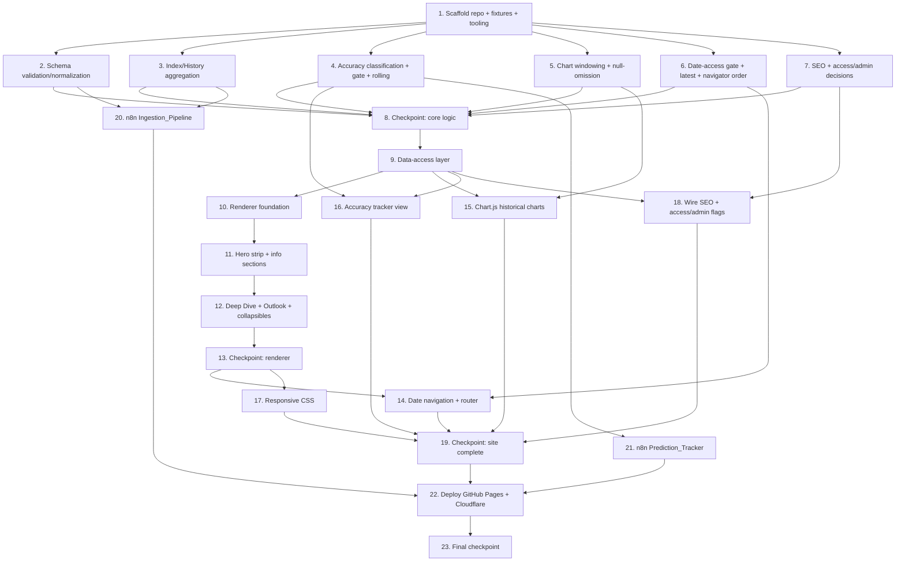

# Implementation Plan: NSE Pulse

## Overview

This plan implements **MVP B** of NSE Pulse: the per-day JSON data contract, a framework-free static site (HTML/CSS/JS + Chart.js) that renders briefings, 30-day historical charts, and a prediction-accuracy tracker, plus the two n8n automation workflows (Ingestion_Pipeline and Prediction_Tracker) that write the data contract, and deployment to GitHub Pages behind a Cloudflare subdomain.

The work is sequenced so that the **shared, pure JavaScript logic** (schema validation/normalization, index/history aggregation, accuracy classification, rolling-accuracy, chart windowing/null-omission, date-access gate, SEO construction, and access/admin decisions) is built and property-tested **first**. Both the static site and the n8n function nodes import this shared logic, so the correctness properties are verified once and reused everywhere.

**Testing approach (from the design's Testing Strategy):**
- **Property-based tests** use **fast-check** with **Vitest**, a **minimum of 100 iterations** per test. Each correctness property (Properties 1–25) is implemented by a single property-based test, tagged with a comment of the form `Feature: nse-pulse, Property {number}: {property_text}`.
- **Example-based unit tests** cover concrete branches and EXAMPLE-classified criteria.
- **Integration/manual checks** cover INTEGRATION/SMOKE criteria (n8n triggers, external fetch/timeout, hosting, responsive layout) that are not suitable for property-based testing.
- Sub-tasks marked with `*` are optional (tests / verification) and can be skipped for a faster MVP path; un-marked sub-tasks are core implementation.

## Tasks

- [x] 1. Scaffold the Data_Store repository and tooling
  - [x] 1.1 Create the repository directory structure and static-site shell
    - Create `data/briefings/`, `data/`, `assets/css/`, `assets/js/` directories
    - Create an empty `index.html` shell that loads `assets/css/style.css`, the Chart.js CDN, and `assets/js/app.js`, `assets/js/charts.js`, `assets/js/tracker.js`
    - _Requirements: 10.1, 10.5_
  - [x] 1.2 Author the sample JSON data fixtures
    - Create a sample `data/briefings/2026-06-22.json` Briefing_File from the 22 June 2026 briefing data, conforming exactly to the Per-Day JSON Schema (all top-level objects present, explicit `null` for absent values, 1–5 scenarios with `range_low <= range_high`)
    - Create `data/index.json` containing `{ "dates": ["2026-06-22"] }`
    - Create `data/history.json` containing one ascending `series` row for 2026-06-22
    - _Requirements: 1.1, 1.2, 1.3, 1.4, 1.6, 1.7, 1.8, 1.9, 1.10, 1.11, 2.1, 2.3_
  - [x] 1.3 Set up the JavaScript test runner and property-testing library
    - Add `package.json` with Vitest and fast-check as dev dependencies and a `test` script using single-run mode (e.g., `vitest --run`)
    - Configure a shared fast-check default of `numRuns: 100` (minimum) for property-based tests
    - Verify the static site has no front-end framework dependency
    - _Requirements: 10.5_

- [x] 2. Implement schema validation and normalization (shared core)
  - [x] 2.1 Implement the Per-Day JSON Schema validator and normalizer
    - Write `assets/js/lib/schema.js` exporting `validateBriefing(obj)` (returns valid iff conforming and `meta.date` non-null) and `normalizeBriefing(obj)` (fills every absent value with explicit `null`, never drops keys)
    - Enforce invariants I1–I6: 1–5 scenarios, `0 <= probability <= 100`, `range_low <= range_high`, `session_status` enum, `accuracy_tag` enum, all keys present
    - _Requirements: 1.2, 1.3, 1.4, 1.5, 1.6, 1.7, 1.8, 1.9, 1.10, 1.11, 3.3, 3.4, 3.7_
  - [x]* 2.2 Write property test for schema conformance and null-preservation round-trip
    - **Property 1: Schema conformance and null-preservation round-trip**
    - **Validates: Requirements 1.2, 1.3, 1.4, 1.5, 1.6, 1.7, 1.10, 1.11, 3.3**
    - Implement a `genBriefing` arbitrary (controlled nulls, empty lists, boundary probabilities, equal `range_low`/`range_high`, 1–5 scenarios, tied probabilities, non-ASCII strings, length bounds)
  - [x]* 2.3 Write property test for outlook scenario invariants
    - **Property 2: Outlook scenario invariants**
    - **Validates: Requirements 1.8, 1.9**
  - [x]* 2.4 Write property test for schema validation accept/reject
    - **Property 3: Schema validation accepts valid and rejects invalid**
    - **Validates: Requirements 3.4, 3.7, 1.12**
    - Generate both conforming objects and objects with injected violations (missing key, wrong type, out-of-range probability, `range_low > range_high`, bad enum, null/absent `meta.date`)
  - [x]* 2.5 Write unit tests for representative valid/invalid examples
    - Cover the 2026-06-22 fixture and concrete malformed cases
    - _Requirements: 1.2, 3.7_

- [x] 3. Implement index and history aggregation (shared core)
  - [x] 3.1 Implement briefing filename derivation
    - Write `deriveBriefingPath(briefing)` returning `/data/briefings/{meta.date}.json`
    - _Requirements: 1.1, 3.4_
  - [x]* 3.2 Write property test for filename derivation
    - **Property 4: Briefing filename derives from meta.date**
    - **Validates: Requirements 1.1, 3.4**
  - [x] 3.3 Implement Index_File aggregation
    - Write `upsertIndexDate(index, date)`: insert keeping strictly ascending order, dedupe (no-op if present), create empty index if absent
    - _Requirements: 2.1, 2.2, 2.5, 2.6_
  - [x]* 3.4 Write property test for index completeness, ordering, dedup, idempotence
    - **Property 5: Index file is complete, ascending, duplicate-free, and idempotent**
    - **Validates: Requirements 2.1, 2.2, 2.6**
  - [x] 3.5 Implement History_File aggregation
    - Write `upsertHistoryRow(history, row)`: append in ascending date order, replace (not append) an existing date's row, create empty history if absent
    - _Requirements: 2.3, 2.4, 2.5, 2.7_
  - [x]* 3.6 Write property test for history ordering and replace-not-append idempotence
    - **Property 6: History file is ascending and replace-not-append idempotent**
    - **Validates: Requirements 2.3, 2.4, 2.7**
  - [x]* 3.7 Write unit tests for missing-file creation of index/history
    - _Requirements: 2.5_

- [x] 4. Implement accuracy classification, trading-day gate, and rolling accuracy (shared core)
  - [x] 4.1 Implement the accuracy classification algorithm
    - Write `classifyAccuracy(actualClose, scenarios)` with inclusive in-range test, highest-probability scenario selected by first-in-list-order tie-break, returning `{ accuracy_tag, matched_scenario }` per Correct/Partial/Wrong rules
    - _Requirements: 7.2, 7.3, 7.4, 7.5, 7.6, 7.7_
  - [x]* 4.2 Write property test for accuracy classification correctness
    - **Property 16: Accuracy classification correctness**
    - **Validates: Requirements 7.2, 7.3, 7.4, 7.5, 7.6, 7.7**
  - [x] 4.3 Implement the trading-day / holiday-weekend skip gate
    - Write `shouldSkipVerification(date, holidayList)` returning a skip decision with "no notification" semantics for weekends/holidays
    - _Requirements: 12.3, 12.4_
  - [x]* 4.4 Write property test for non-trading-day skip
    - **Property 19: Non-trading-day skip leaves results unchanged with no notification**
    - **Validates: Requirements 12.3, 12.4**
  - [x] 4.5 Implement rolling-accuracy computation and display-state selection
    - Write `rollingAccuracy(taggedSequence)` over the most recent 30 Trading_Days with a non-null tag (non-trading days excluded), returning the display state ("no verified predictions yet" / "no verified correct predictions yet" / `round(correct/tagged*100, 1)`)
    - _Requirements: 8.2, 8.3, 8.5, 12.5_
  - [x]* 4.6 Write property test for rolling accuracy computation and display state
    - **Property 17: Rolling accuracy computation and display state**
    - **Validates: Requirements 8.2, 8.3, 8.5, 12.5**
    - Implement a `genTagSequence` arbitrary covering all-Wrong, no-tagged, and >30-window cases

- [x] 5. Implement chart windowing and null-omission helpers (shared core)
  - [x] 5.1 Implement the 30-day windowing helper
    - Write `windowSeries(series, n=30)` returning the most recent `min(30, len)` rows in ascending order
    - _Requirements: 6.4, 6.5_
  - [x]* 5.2 Write property test for chart window size
    - **Property 14: Chart window is the most recent min(30, n) days**
    - **Validates: Requirements 6.4, 6.5**
    - Implement a `genHistory` arbitrary with lengths spanning 0, <30, =30, >30
  - [x] 5.3 Implement the null-omission point builder
    - Write `plottablePoints(series, metric)` that maps null metric values to omitted points (null y, never a substituted/zero value), preserving order
    - _Requirements: 6.6_
  - [x]* 5.4 Write property test for null point omission
    - **Property 15: Null chart points are omitted without substitution**
    - **Validates: Requirements 6.6**

- [x] 6. Implement date-access gate, latest-date, and navigator-ordering helpers (shared core)
  - [x] 6.1 Implement latest-date selection
    - Write `getLatestDate(index)` returning the maximum (most recent) date
    - _Requirements: 4.1_
  - [x]* 6.2 Write property test for latest-date default selection
    - **Property 7: Latest-date default selection**
    - **Validates: Requirements 4.1**
  - [x] 6.3 Implement the date-access gate
    - Write `isDateAccessible(dateStr, index)` granting access iff `dateStr` is a valid ISO-8601 calendar date present in the index
    - _Requirements: 5.3, 5.5, 5.6, 12.2_
  - [x]* 6.4 Write property test for the date-access gate
    - **Property 9: Date-access gate**
    - **Validates: Requirements 5.3, 5.5, 5.6, 12.2**
    - Implement a `genDateRequest` arbitrary mixing valid ISO dates (in/out of index) and malformed strings
  - [x] 6.5 Implement navigator descending-order helper
    - Write `navigatorDates(index)` returning index dates most-recent-first
    - _Requirements: 5.1_
  - [x]* 6.6 Write property test for navigator descending order
    - **Property 8: Date-navigator descending order**
    - **Validates: Requirements 5.1**

- [x] 7. Implement SEO construction and access/admin decision helpers (shared core)
  - [x] 7.1 Implement SEO metadata construction
    - Write `buildSeo(briefing)` producing a page title and a meta description (<=160 chars) from whichever of `meta.date` and `meta.market_tone` are available, never erroring on nulls
    - _Requirements: 14.1, 14.2, 14.3_
  - [x]* 7.2 Write property test for SEO metadata construction
    - **Property 24: SEO metadata construction with availability fallback**
    - **Validates: Requirements 14.1, 14.2, 14.3**
  - [x] 7.3 Implement the access-control decision and gated-content classifier
    - Write `isGated(item, latestDate)` (non-latest briefing, any chart, or `deep_dive`) and `accessDecision(item, config, authenticated)` returning granted / withheld+prompt
    - _Requirements: 11.2, 11.3, 11.4, 11.5_
  - [x]* 7.4 Write property test for the access-control decision
    - **Property 20: Access-control decision**
    - **Validates: Requirements 11.2, 11.3, 11.4, 11.5**
  - [x] 7.5 Implement the admin-notes visibility decision
    - Write `adminNotesDecision(briefing, adminViewEnabled)` returning whether to include/display notes (and asserting the <=5000-char bound)
    - _Requirements: 14.4, 14.5, 14.6, 14.7_
  - [x]* 7.6 Write property test for admin-notes visibility and length bound
    - **Property 25: Admin notes visibility and length bound**
    - **Validates: Requirements 14.4, 14.5, 14.6, 14.7**

- [x] 8. Checkpoint - shared core logic complete
  - Ensure all tests pass, ask the user if questions arise.

- [x] 9. Implement the data-access layer
  - [x] 9.1 Implement the single configurable DataAccess module
    - Write `assets/js/lib/data-access.js` exposing `getIndex()`, `getHistory()`, `getBriefing(dateStr)`, `getLatestDate(index)` as the sole `fetch` surface, reading `config.dataBaseUrl` and honoring `accessControlEnabled`/`adminViewEnabled` flags
    - _Requirements: 11.1, 10.2, 4.1, 5.2, 6.1_
  - [x]* 9.2 Write unit tests for data-access load-failure messages (mocked fetch)
    - Cover briefing load failure (R13.2), index load failure (R13.3), history load failure (R6.8)
    - _Requirements: 13.2, 13.3, 6.8_

- [x] 10. Implement the briefing renderer foundation
  - [x] 10.1 Implement the render container with independent, fault-isolated sections
    - Write the renderer scaffold in `assets/js/app.js` so each section renders independently and one bad field cannot suppress others
    - _Requirements: 13.5_
  - [x]* 10.2 Write property test for partial-render robustness
    - **Property 23: Partial-render robustness**
    - **Validates: Requirements 13.5**
  - [x] 10.3 Implement the null-scalar placeholder helper
    - Render a distinct placeholder (dash) for null scalars, distinct from an empty value
    - _Requirements: 13.1_
  - [x]* 10.4 Write property test for null-scalar placeholder rendering
    - **Property 21: Null scalars render a distinct placeholder**
    - **Validates: Requirements 13.1**

- [x] 11. Implement the hero strip and informational display sections
  - [x] 11.1 Implement the hero strip (exactly four cards)
    - Render Nifty50, Sensex, FII net, DII net cards, each showing value or placeholder
    - _Requirements: 4.3_
  - [x]* 11.2 Write property test for the hero strip
    - **Property 10: Hero strip renders exactly four cards**
    - **Validates: Requirements 4.3**
  - [x] 11.3 Implement Market Snapshot, Movers, and Macro sections
    - Render breadth/sector/tone, key gainers & losers tables, Brent/10y-yield/domestic/global triggers
    - _Requirements: 4.4, 4.5, 4.6_
  - [x] 11.4 Implement per-section empty-list messages
    - Show a "no entries available" message for empty `key_gainers`, `key_losers`, `support_levels`, `resistance_levels`, `key_watch`
    - _Requirements: 13.4_
  - [x]* 11.5 Write property test for empty-list section messages
    - **Property 22: Empty list fields show a per-section message**
    - **Validates: Requirements 13.4**
  - [x]* 11.6 Write unit tests for header and section presence
    - Header/logo/navigator presence and Snapshot/Movers/Macro/Deep Dive section presence
    - _Requirements: 4.2, 4.4, 4.5, 4.6, 4.7_

- [x] 12. Implement the Deep Dive and Outlook sections with collapsible controls
  - [x] 12.1 Implement the Outlook section with proportional probability bars
    - Render each scenario name and a bar whose filled fraction equals `probability / 100`, plus support/resistance/key-watch
    - _Requirements: 4.8_
  - [x]* 12.2 Write property test for proportional probability bars
    - **Property 11: Outlook probability bars are proportional**
    - **Validates: Requirements 4.8**
  - [x] 12.3 Implement collapsible section toggling and the Deep Dive collapsible container
    - Toggle switches a section to the opposite of its current visibility; render `deep_dive.full_text` collapsibly
    - _Requirements: 4.7, 4.9_
  - [x]* 12.4 Write property test for collapsible toggle involution
    - **Property 12: Collapsible toggle is an involution**
    - **Validates: Requirements 4.9**

- [x] 13. Checkpoint - renderer complete
  - Ensure all tests pass, ask the user if questions arise.

- [x] 14. Implement date navigation and the router
  - [x] 14.1 Implement the router and date handling
    - Parse the requested date from the URL, default to latest, apply the date-access gate, and show the correct "no briefing available" / "no briefing for that date" / "no trading session" messages while keeping the navigator usable
    - _Requirements: 4.1, 5.2, 5.4, 5.5, 5.6, 12.1_
  - [x] 14.2 Wire the Date_Navigator UI (descending, restricted to index dates)
    - Render dates most-recent-first and disallow selection of dates absent from the index
    - _Requirements: 5.1, 5.3, 12.2_
  - [x]* 14.3 Write unit tests for date-in-index-missing-file and holiday messages
    - _Requirements: 5.4, 12.1_

- [x] 15. Implement the Chart.js historical charts
  - [x] 15.1 Implement the tabbed chart container reading from History_File
    - Build four Chart.js charts (Nifty Trend, FII/DII Flows, Market Breadth, Sectors) wired to the data-access layer, using `windowSeries` and `plottablePoints`; use `spanGaps: true` with null y-values (never 0)
    - _Requirements: 6.1, 6.2, 6.4, 6.5, 6.6_
  - [x] 15.2 Implement tab visibility (exactly one visible, Nifty Trend first)
    - Selecting a tab shows only that chart; Nifty Trend shown on initial render
    - _Requirements: 6.3, 6.7_
  - [x]* 15.3 Write property test for exactly-one-chart-tab-visible
    - **Property 13: Exactly one chart tab visible**
    - **Validates: Requirements 6.3, 6.7**
  - [x]* 15.4 Write unit tests for chart unavailable/empty messages and tab presence
    - History fetch/parse failure (R6.8), zero Trading_Days (R6.9), four tabs present (R6.2), initial Nifty-Trend render (R6.7)
    - _Requirements: 6.2, 6.7, 6.8, 6.9_

- [x] 16. Implement the Accuracy Tracker view
  - [x] 16.1 Implement the 30-day accuracy calendar with distinct markers
    - Mark each Trading_Day having a non-null `accuracy_tag` with a distinct Correct/Partial/Wrong indicator; unmarked days carry no marker; exclude holidays/weekends
    - _Requirements: 8.1, 12.5_
  - [x]* 16.2 Write property test for the calendar marker mapping
    - **Property 18: Accuracy calendar marker mapping**
    - **Validates: Requirements 8.1**
  - [x] 16.3 Wire the rolling-accuracy display states into the view
    - Render the rolling percentage or the appropriate "no verified..." message using the shared `rollingAccuracy` helper
    - _Requirements: 8.2, 8.3, 8.5_
  - [x] 16.4 Implement day-selection navigation from the calendar
    - Selecting a marked day displays that day's Briefing_File
    - _Requirements: 8.4_
  - [x]* 16.5 Write unit test for calendar day-selection navigation
    - _Requirements: 8.4_

- [x] 17. Implement responsive layout CSS
  - [x] 17.1 Implement the responsive stylesheet
    - In `assets/css/style.css`: 768px breakpoint, two-column layout >=768px with Deep Dive/Macro/Outlook expanded; single-column 320–767px with those sections collapsed by default and no horizontal scroll; sticky/fixed header
    - _Requirements: 9.1, 9.2, 9.3, 9.4, 9.5, 9.6_
  - [x]* 17.2 Manual responsive verification at 320px and >=768px
    - Verify two-column vs single-column, default collapsed/expanded sections, no horizontal scroll, sticky header
    - _Requirements: 9.1, 9.2, 9.3, 9.4, 9.5, 9.6_

- [x] 18. Wire SEO metadata and access/admin flags into the site
  - [x] 18.1 Wire SEO construction into the render path
    - Set `document.title` and `<meta name="description">` from `buildSeo` on every render
    - _Requirements: 14.1, 14.2, 14.3_
  - [x] 18.2 Wire the access-control flag and gating into DataAccess/render
    - Enforce gated-content withholding + auth prompt when `accessControlEnabled`, including failed-auth message; open access when disabled
    - _Requirements: 11.2, 11.3, 11.4, 11.5, 11.6_
  - [x] 18.3 Wire admin-notes visibility and source exclusion into render
    - When `adminViewEnabled` is off, exclude `admin_notes` from both rendered page and delivered source; when on, display non-empty notes and render cleanly when null/empty
    - _Requirements: 14.5, 14.6, 14.7_
  - [x]* 18.4 Write unit test for the failed-authentication message branch
    - _Requirements: 11.6_

- [x] 19. Checkpoint - static site feature-complete
  - Ensure all tests pass, ask the user if questions arise.

- [x] 20. Implement the n8n Ingestion_Pipeline (Workflow 1)
  - [x] 20.1 Build the ingestion workflow nodes
    - Gmail trigger (subject "NSE Market Briefing"); extract/normalize body capturing subject + arrival timestamp; OpenAI parse node; schema-validation function node importing the shared `validateBriefing`; GitHub commit with retry-up-to-3; index/history update function nodes importing the shared `upsertIndexDate`/`upsertHistoryRow`
    - _Requirements: 2.1, 2.2, 2.3, 2.4, 2.5, 2.6, 2.7, 3.4, 3.5, 3.8_
  - [x] 20.2 Author the defensive Briefing_Parser system prompt
    - Describe the exact schema, require emitting every field with `null` for absent values, enforce enums/invariants, and request strict JSON-only output
    - _Requirements: 3.3, 1.5, 1.8, 1.9, 1.11_
  - [x]* 20.3 Write unit tests for the notification and overwrite branches
    - Parse-failure (R3.6), schema-validation-failure (R3.7), commit-failure (R3.9) notification logic, and re-commit overwrite (R3.5)
    - _Requirements: 3.5, 3.6, 3.7, 3.9_
  - [x]* 20.4 Integration verification of ingestion timing and commit retry
    - Gmail trigger fires and parser invoked within 5 minutes; parse completes within 120s; commit retries up to 3 additional times against a failing remote
    - _Requirements: 3.1, 3.2, 3.8_

- [x] 21. Implement the n8n Prediction_Tracker (Workflow 2)
  - [x] 21.1 Build the prediction-tracker workflow nodes
    - Schedule trigger (~4:30PM IST); trading-day gate function node importing shared `shouldSkipVerification`; read prior Briefing_File; classify function node importing shared `classifyAccuracy`; GitHub write-back of `actual_close`, `actual_change_pct`, `matched_scenario`, `accuracy_tag`, `verified_at`
    - _Requirements: 7.7, 12.3, 12.4_
  - [x]* 21.2 Write unit test for the both-sources-fail branch and write-back
    - Leave all `prediction_result` fields null + send error notification when both sources fail (R7.9); verify write-back fields (R7.7)
    - _Requirements: 7.7, 7.9_
  - [x]* 21.3 Integration verification of market-data fetch with failover
    - Yahoo Finance primary fetch with 30s timeout; Upstox backup failover with 30s timeout
    - _Requirements: 7.1, 7.8_

- [x] 22. Deploy to GitHub Pages and Cloudflare
  - [x] 22.1 Add deployment configuration files
    - Add GitHub Pages configuration and a `CNAME` file for the Cloudflare subdomain; ensure the site is served as static files with no server-side generation
    - _Requirements: 10.1, 10.3_
  - [x]* 22.2 Write the schema field-name freeze snapshot test
    - Snapshot the Per-Day JSON Schema field names and assert they are unchanged and independent of the access/admin flags
    - _Requirements: 1.12, 11.7_
  - [x]* 22.3 Integration verification of hosting and delivery
    - Confirm GitHub Pages static serving, client-only data access through the single data-access module, Cloudflare subdomain serving, and GitHub Pages fallback; confirm date selection load within 3s with representative data
    - _Requirements: 5.2, 10.1, 10.2, 10.4, 10.5, 11.1_

- [x] 23. Final checkpoint - MVP B complete
  - Ensure all tests pass, ask the user if questions arise.

## Task Dependency Graph

## Property-to-Task Traceability

| Property | Task | Property | Task |
|---|---|---|---|
| 1 | 2.2 | 14 | 5.2 |
| 2 | 2.3 | 15 | 5.4 |
| 3 | 2.4 | 16 | 4.2 |
| 4 | 3.2 | 17 | 4.6 |
| 5 | 3.4 | 18 | 16.2 |
| 6 | 3.6 | 19 | 4.4 |
| 7 | 6.2 | 20 | 7.4 |
| 8 | 6.6 | 21 | 10.4 |
| 9 | 6.4 | 22 | 11.5 |
| 10 | 11.2 | 23 | 10.2 |
| 11 | 12.2 | 24 | 7.2 |
| 12 | 12.4 | 25 | 7.6 |
| 13 | 15.3 | | |

## Out of MVP Scope (Phase 4 — not implemented now)

The following are intentionally **excluded** from this MVP plan. The data contract (Properties 1–4) and access-model abstractions (Properties 20, 25) are built and tested now so these can be added later without re-architecting:

- Supabase authentication integrated into the data-access layer.
- Razorpay/Stripe paywall enforced over the gated content defined in Requirement 11.2.

## Notes

- Sub-tasks marked with `*` are optional (property tests, unit tests, and integration/manual verification) and can be skipped for a faster MVP path. Top-level tasks and core implementation sub-tasks are never optional.
- Each property-based test must run a **minimum of 100 iterations** with fast-check and carry a `Feature: nse-pulse, Property {n}` tag comment.
- The shared `assets/js/lib/*` modules are imported by both the static site and the n8n function nodes, so each correctness property is verified once and reused across the site and the automation workflows.
- Checkpoints (tasks 8, 13, 19, 23) provide incremental validation points.
